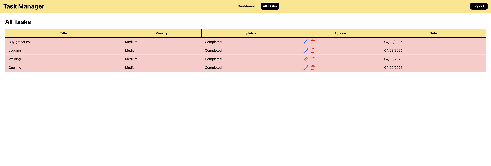

# Task Manager

**Description:**
A full-stack web application using **React, Shadcn/UI, Tailwind CSS v4** on the frontend and **Node.js, Express, MongoDB** on the backend. This app includes authentication, dashboard, tasks management, and modals for editing tasks.

---

## Table of Contents

- [Demo Screenshots](#demo-screenshots)
- [Folder Structure](#folder-structure)
- [Technologies & Packages Used](#technologies--packages-used)
- [Installation](#installation)
- [Usage](#usage)
- [License](#license)

---

## Demo Screenshots

| Page            | Screenshot                                  |
| --------------- | ------------------------------------------- |
| Login Page      |         |
| Register Page   |   |
| Dashboard       |      |
| All Tasks Page  |      |
| Edit Task Modal |     |
| Add Task Modal  |  |

---

## Folder Structure

```
project-root/
│
├─ client/
│  ├─ public/
│  ├─ src/
│  │  ├─ components/
│  │  ├─ layouts/
│  │  ├─ pages/
│  │  ├─ App.jsx
│  │  ├─ main.jsx
│  │  └─ index.css
│  ├─ package.json
│
├─ server/
│  ├─ controllers/
│  ├─ models/
│  ├─ routes/
│  ├─ middlewares/
│  ├─ config/
│  ├─ server.js
│  └─ package.json
│
└─ README.md
```

---

## Technologies & Packages Used

### Frontend (client/)

- React 18
- Vite
- Tailwind CSS v4
- lucide-react
- formik
- yup
- axios
- react-toastify
- recharts
- react-big-calendar
- jwt-decode

### Backend (server/)

- Node.js
- Express.js
- MongoDB + Mongoose
- bcrypt
- jsonwebtoken
- cors
- nodemon

---

## Installation and Usage

### Frontend

```bash
cd client
npm install
npm run dev
```

### Backend

```bash
cd server
npm install
npm run dev
```

---
